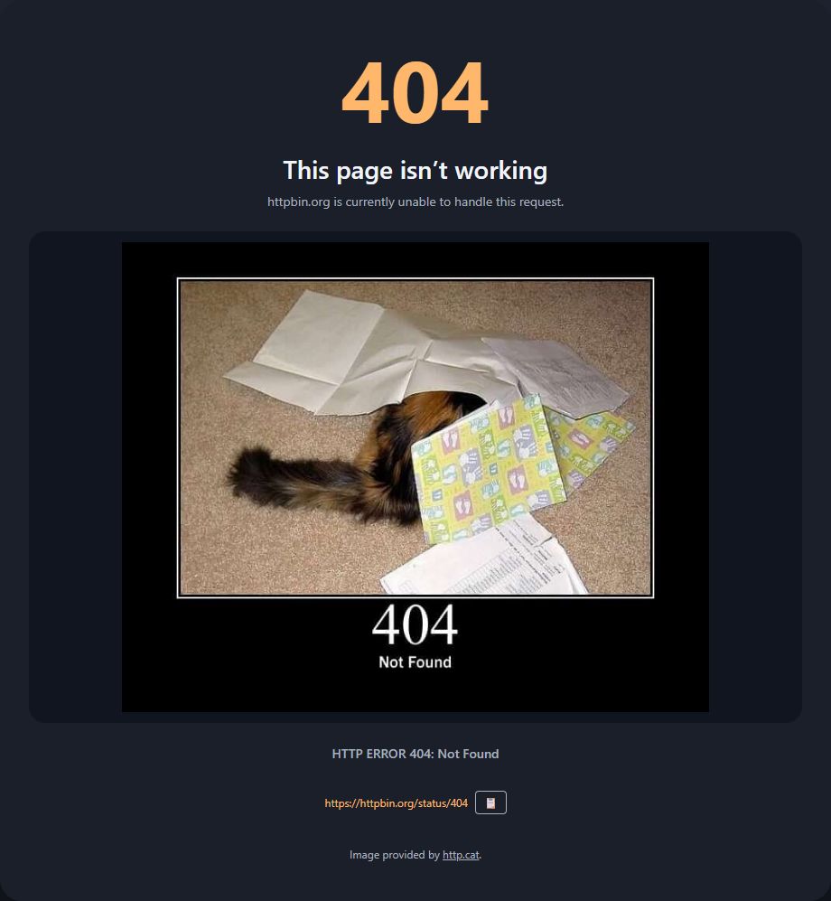
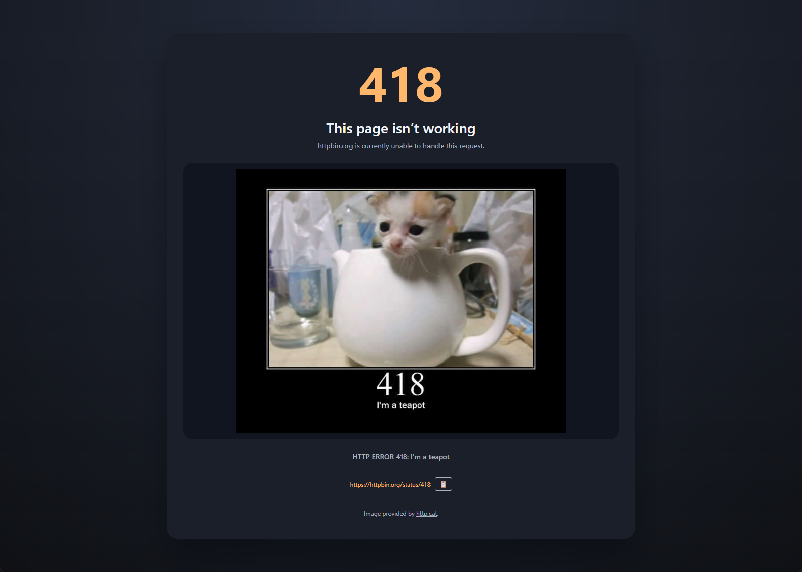
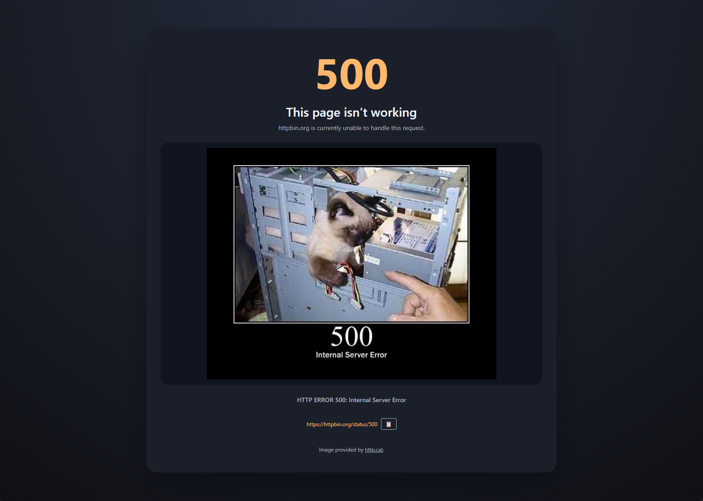
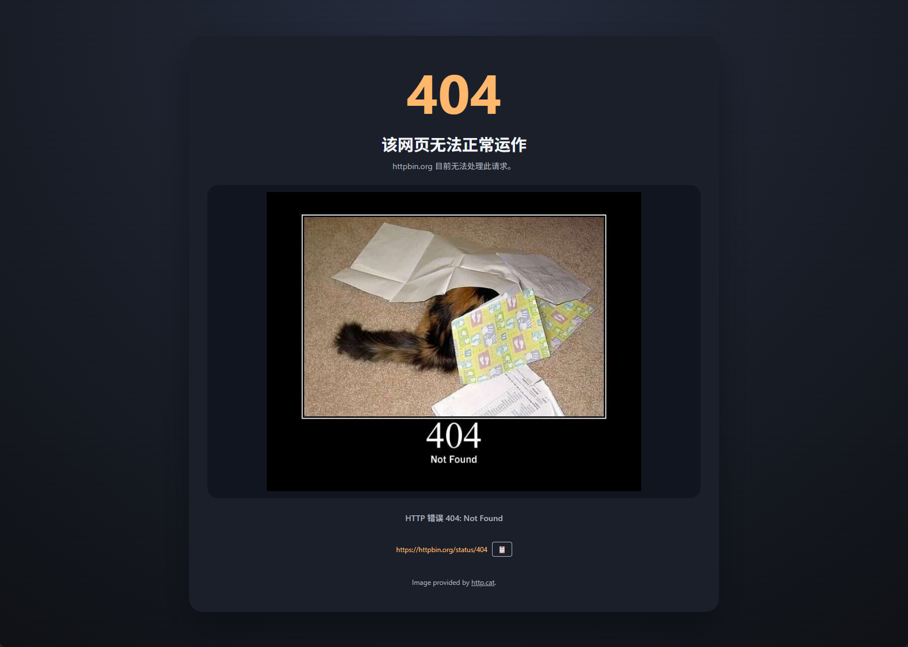
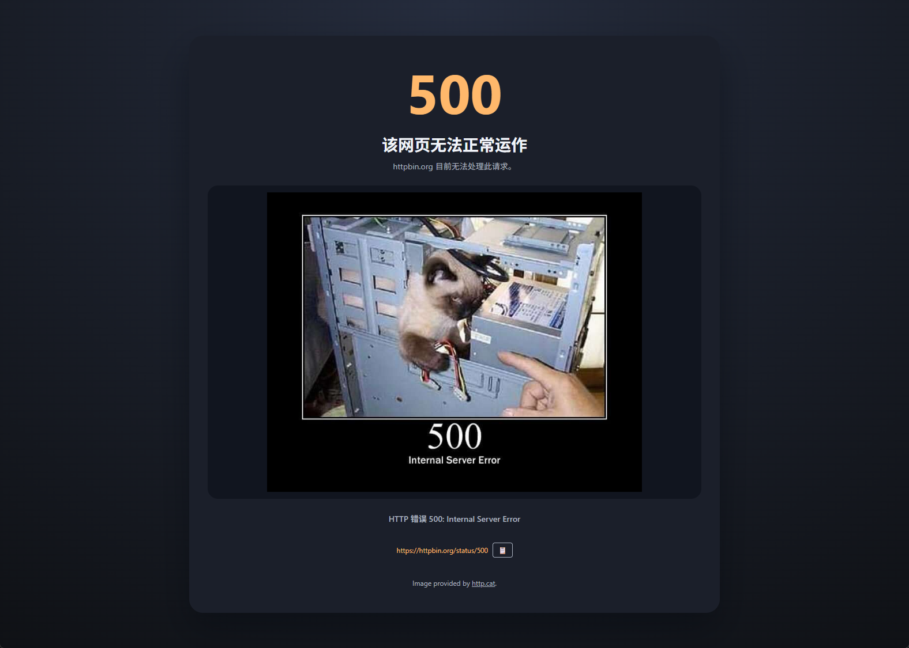

# HTTP Cats Error Pages

> Replace HTTP error pages with adorable cat images. A Chrome extension that intercepts browser errors and displays them with style powered by http.cat.

**Features:** All HTTP error codes • Multi-language UI • One-click URL copy • Works on Chrome/Edge/Chromium

[English](#english) | [中文](#中文)

---

## English

Replace browser error pages with cute HTTP cat images from https://http.cat/. This Chrome extension automatically intercepts all HTTP error codes (4xx/5xx) and navigation failures, displaying a stylized error page featuring the perfect cat for each error code.

### Features
- ✨ **All HTTP Codes**: Supports all error codes available on http.cat (100-599)
- 🎨 **Beautiful UI**: Clean, modern error page design inspired by Chrome's default error style
- 🌐 **Multi-language**: Auto-detects browser language (Chinese/English)
- 🔗 **Clickable URLs**: Shows original URL with one-click copy button
- 🚀 **All Chromium Browsers**: Works on Chrome, Edge, and other Chromium-based browsers
- 📡 **Online Image Loading**: Fetches cat images directly from http.cat CDN

### Screenshots

| HTTP 404 | HTTP 418 | HTTP 500 |
|----------|----------|----------|
|  |  |  |

### Installation (Developer Mode)
1. Download or clone this repository
2. Open `chrome://extensions` in Chrome/Edge
3. Enable **Developer mode** (top right corner)
4. Click **Load unpacked** and select this folder
5. Navigate to any URL that returns an HTTP error to see the cat!

### How It Works
1. The background service worker monitors all main-frame HTTP responses
2. When a response status ≥ 400 is detected, the tab redirects to the extension's error page
3. The error page displays the status code, original URL, and corresponding http.cat image
4. Supports network errors with HTTP 520 as fallback

### Permissions
| Permission | Purpose |
|-----------|---------|
| `webRequest` | Monitor main-frame HTTP response codes |
| `webNavigation` | Detect navigation errors (DNS, timeout, etc.) |
| `tabs` | Redirect to error page |
| `<all_urls>` | Monitor all navigations |

### Limitations & Notes
- Chrome blocks direct replacement of chrome-error:// pages; this extension redirects after detecting an error
- Network-level errors (DNS, offline) use HTTP 520 as fallback status code
- Images are loaded online from http.cat CDN

### Attribution
All cat images are provided by [http.cat](https://http.cat/)

---

## 中文

将浏览器错误页面替换为来自 https://http.cat/ 的可爱猫咪图片。这个 Chrome 扩展程序自动拦截所有 HTTP 错误代码 (4xx/5xx) 和导航失败，显示一个风格化的错误页面，为每个错误代码配对一只完美的猫咪。

### 功能特性
- ✨ **全错误代码支持**: 支持 http.cat 上的所有错误代码（100-599）
- 🎨 **精美界面**: 简洁现代的错误页面设计，灵感源自 Chrome 默认错误样式
- 🌐 **多语言自适应**: 自动检测浏览器语言（中文/英文）
- 🔗 **可点击网址**: 显示原始 URL，一键复制按钮
- 🚀 **全 Chromium 浏览器支持**: 适用于 Chrome、Edge 等所有基于 Chromium 的浏览器
- 📡 **在线图片加载**: 直接从 http.cat CDN 获取猫咪图片

### 截图

| HTTP 404 | HTTP 418 | HTTP 500 |
|----------|----------|----------|
|  |  |  |

### 安装步骤（开发者模式）
1. 下载或克隆此仓库
2. 在 Chrome/Edge 中打开 `chrome://extensions`
3. 启用右上角的**开发者模式**
4. 点击**加载已解压的扩展程序**，选择本文件夹
5. 访问任意返回 HTTP 错误的网页，即可看到猫咪！

### 工作原理
1. 后台服务脚本监控所有主框架 HTTP 响应
2. 当检测到响应状态码 ≥ 400 时，标签页重定向到扩展的错误页面
3. 错误页面显示状态码、原始 URL 和对应的 http.cat 图片
4. 网络错误使用 HTTP 520 作为回退状态码

### 权限说明
| 权限 | 用途 |
|-----|------|
| `webRequest` | 监控主框架 HTTP 响应代码 |
| `webNavigation` | 检测导航错误（DNS、超时等） |
| `tabs` | 重定向到错误页面 |
| `<all_urls>` | 监控所有导航 |

### 限制与注意
- Chrome 不允许直接替换 chrome-error:// 页面；本扩展在检测到错误后进行重定向
- 网络级错误（DNS、离线）使用 HTTP 520 作为回退状态码
- 图片从 http.cat CDN 在线加载

### 致谢
所有猫咪图片由 [http.cat](https://http.cat/) 提供
